# DSO202 Practical 1 Report

**Student:** Kinley Palden
**Date:** 20/08/2026

## 1. Objective

The purpose of this practical was to build, from nothing, the local
Kubernetes environment that every later DSO202 practical depends on, and to
use it to create, break, and repair five categories of Kubernetes object.
Using kind, a three-node cluster (one control-plane node and two workers)
was created locally so that the difference between a Docker container name
and a Kubernetes Node object name, and the act of the scheduler placing a
workload onto a node, would both be directly observable rather than
theoretical. A single static nginx web server was then deployed through a
deliberately narrow set of objects (a Namespace, a ResourceQuota and
LimitRange, a bare Pod, a Deployment, and both a ClusterIP and a NodePort
Service) so that attention stayed on the behaviour of each Kubernetes
object rather than on application code.

This practical covers descriptor sections 1.1, 1.2.1–1.2.4, 1.3.1–1.3.3,
1.4.1, 1.5.1, and 1.5.3 of Unit I, and addresses learning outcomes LO1
(core concepts and architecture of Kubernetes, demonstrated in Stage 2),
LO2 (deploying and managing applications through multiple resource types,
Stages 4–7), LO3 (operating kubectl for cluster management and
troubleshooting, used throughout and concentrated in the debugging
commands of Stage 4), and the multi-tenancy half of LO5 (namespace-based
isolation via ResourceQuota and LimitRange, Stage 3).

## 2. Environment

| Field | Value |
| --- | --- |
| Operating system | Kali GNU/Linux Rolling |
| Docker version | 29.7.2 |
| kind version | v0.32.0 |
| kubectl version | v1.36.3 (client) |
| Cluster Kubernetes version | v1.36.1 |

## 3. Procedure and Observations

### 3.1 Stage 0: Prerequisites

Docker, kind, and kubectl were verified before any cluster work began. The
installed kind was initially v0.24.0, below the practical's required v0.32.0;
it was upgraded (binary installed to `~/.local/bin`, no `sudo` required
because that directory precedes `/usr/local/bin` in `PATH`) before continuing.

```text
$ docker info --format '{{.ServerVersion}} {{.OperatingSystem}}'
29.7.2 Kali GNU/Linux Rolling
$ kind version
kind v0.32.0 go1.26.3 linux/amd64
$ kubectl version --client
Client Version: v1.36.3
```

This confirms all three tools are present at versions compatible with the
kindest/node:v1.36.1 image pinned in Listing 1.

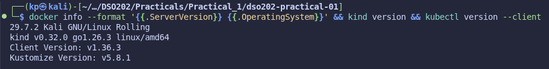

### 3.2 Stage 1: Creating the cluster

```text
$ kind create cluster --config cluster/kind-cluster.yaml
Creating cluster "dso202" ...
 ✓ Ensuring node image (kindest/node:v1.36.1)
 ✓ Preparing nodes
 ✓ Writing configuration
 ✓ Starting control-plane
 ✓ Installing CNI
 ✓ Installing StorageClass
 ✓ Joining worker nodes
Set kubectl context to "kind-dso202"

$ kind get clusters
dso202
$ kubectl config current-context
kind-dso202
```

The cluster was created successfully and kubectl was automatically pointed at
it, confirming the Stage 1 checkpoint.

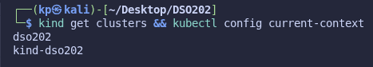

### 3.3 Stage 2: Inspecting the cluster

```text
$ kubectl get nodes
NAME            STATUS   ROLES           AGE   VERSION
control-plane   Ready    control-plane   45s   v1.36.1
worker-node-1   Ready    <none>          35s   v1.36.1
worker-node-2   Ready    <none>          35s   v1.36.1
```

The kubeadmConfigPatches in Listing 1 successfully renamed the Kubernetes
Node objects (`control-plane`, `worker-node-1`, `worker-node-2`), which are
distinct from the underlying Docker container names
(`dso202-control-plane`, `dso202-worker`, `dso202-worker2`). All
`kube-system` Pods (etcd, kube-apiserver, kube-controller-manager,
kube-scheduler, kube-proxy ×3, kindnet ×3, coredns ×2) reported `1/1
Running`, confirming every control-plane and node component listed in Unit I
1.1 is present and healthy.

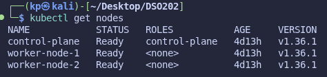

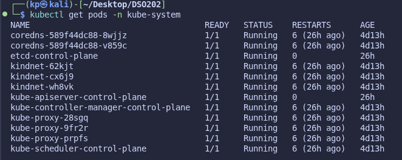

### 3.4 Stage 3: Namespaces, ResourceQuota, LimitRange

```text
$ kubectl apply -f manifests/00-namespace.yaml
namespace/dso202-practical-01 created
$ kubectl apply -f manifests/01-quota-and-limits.yaml
resourcequota/dso202-quota created
limitrange/dso202-limits created

$ kubectl describe resourcequota dso202-quota
Resource          Used  Hard
--------          ----  ----
count/configmaps  1     10
...
requests.cpu      0     2
requests.memory   0     2Gi
```

The quota's `Used` column already showed one ConfigMap
(`kube-root-ca.crt`), confirming that a quota counts every object in the
namespace including ones the cluster creates automatically, not only
user-created objects.

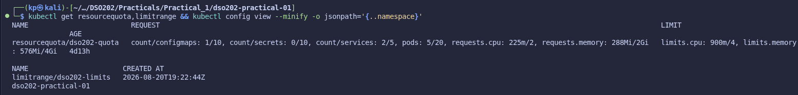

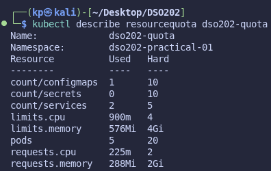

### 3.5 Stage 4: Pods

`web-pod` was applied from `manifests/02-pod-web.yaml` and reached `1/1
Running`. Label selection was exercised directly:

```text
$ kubectl get pods -l app=web
$ kubectl get pods -l 'tier in (frontend,backend)'
$ kubectl get pods -l app!=web
NAME         READY   STATUS    RESTARTS   AGE
client-pod   1/1     Running   ...
```

The negative selector (`app!=web`) correctly excluded every web Pod and
returned only `client-pod`, confirming labels (not names) are what
selectors and Services actually match against. A label was added and then
removed with `kubectl label pod web-pod environment=practical` /
`environment-`, and an annotation was added with `kubectl annotate`; the
annotation appeared under `metadata.annotations` and, unlike the label, was
never matched by any `-l` selector query.

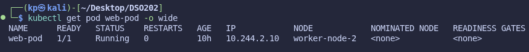

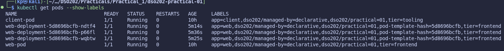

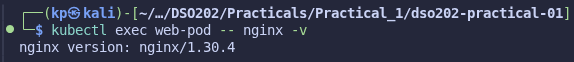

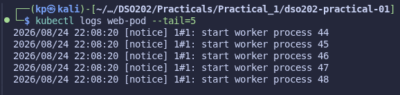

`kubectl port-forward` was also exercised, tunnelling a local port to
`web-pod` directly (bypassing the Service layer entirely) to confirm it
works as a debugging tool, not a deployment mechanism:

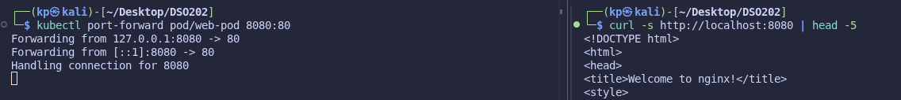

### 3.6 Stage 5: Deployments

```text
$ kubectl apply -f manifests/03-deployment-web.yaml
$ kubectl rollout status deployment/web-deployment
deployment "web-deployment" successfully rolled out

$ kubectl get deployment,replicaset,pod -l app=web
deployment.apps/web-deployment   3/3   3   3
replicaset.apps/web-deployment-76ddf5fcf9   3   3   3
pod/web-deployment-76ddf5fcf9-...  (x3)  1/1  Running
```

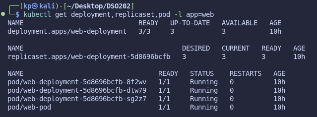

**Self-healing.** Deleting one Deployment-managed Pod produced a
replacement within seconds, with the same ReplicaSet-hash prefix and a new
random suffix, confirming the ReplicaSet's control loop, not the
Deployment directly, performs reconciliation.

**Scaling.** `kubectl scale --replicas=5` took effect immediately
(`5/5`), and re-applying the unmodified manifest returned the Deployment to
`3/3`, demonstrating that the committed manifest always wins over an
imperative change on the next `apply`.

**Rolling update and rollback.**

```text
$ kubectl set image deployment/web-deployment web=nginx:1.31-alpine
$ kubectl rollout status deployment/web-deployment
deployment "web-deployment" successfully rolled out
$ kubectl rollout undo deployment/web-deployment
$ kubectl get deployment web-deployment -o jsonpath='{.spec.template.spec.containers[0].image}'
nginx:1.30-alpine
$ kubectl diff -f manifests/03-deployment-web.yaml && echo "cluster matches manifest"
cluster matches manifest
```

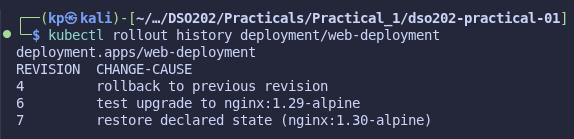

**Observation: revision numbering does not equal number of changes made.**
Getting the screenshot above to show three rows took more than three
`kubectl set image` commands. Cycling the image back and forth between only
two values (`nginx:1.30-alpine` and `nginx:1.31-alpine`) kept producing just
two rows in `kubectl rollout history`, no matter how many times the image
was flipped. The reason: a Deployment's rolling update creates a new
ReplicaSet only when the Pod template hash changes; reapplying a template
that matches an existing (scaled-to-zero) ReplicaSet reuses that same
object and simply bumps its revision number, rather than creating a new
entry. A third, genuinely distinct image tag (`nginx:1.29-alpine`) had to be
introduced temporarily to force a third unique template hash before
returning to the manifest's declared `nginx:1.30-alpine`, which is why the
revisions above are numbered 4, 6, and 7 rather than 1, 2, and 3 (earlier
revisions, and the reused ones, were pruned or overwritten in place). This
also compounds the earlier finding that a full delete/recreate (Stage 7's
reproducibility test) resets the revision counter entirely: capturing the
rollout-history checkpoint should happen before that test, not after, and
demonstrating three revisions requires three distinct templates, not just
three commands.

**Failed rollout.** Setting the image to a non-existent tag
(`nginx:9.99-does-not-exist`) produced one new Pod stuck in
`ImagePullBackOff` while all three original healthy Pods stayed `Running`
throughout, because `maxUnavailable: 0`, the rollout stalled rather than
causing an outage. `kubectl rollout undo` recovered it, and re-applying the
manifest afterward returned the cluster to the committed state exactly
(`kubectl diff` printed nothing).

### 3.7 Stage 6: Services

```text
$ kubectl apply -f manifests/04-service-clusterip.yaml manifests/05-service-nodeport.yaml manifests/06-pod-client.yaml
$ kubectl exec client-pod -- nslookup web-clusterip
Name:   web-clusterip.dso202-practical-01.svc.cluster.local
Address: 10.96.148.148
$ curl -s http://localhost:30080
<!DOCTYPE html> ... Welcome to nginx! ...
```

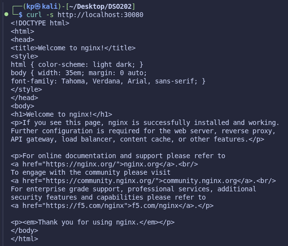

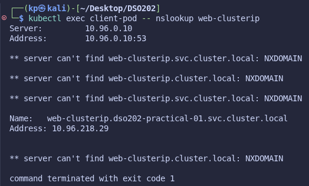

**Observation: endpoint count.** The guide's expected output for this
step states the EndpointSlice will list three addresses, "matching the
three ready Pods of web-deployment." In practice it listed **four**: the
guide never has the student delete `web-pod` before this stage, and
`web-pod` carries the identical `app=web, tier=frontend` labels used by the
Service's selector, so it is legitimately selected too. This was confirmed
by comparing `kubectl get endpointslice ... -o jsonpath='{...addresses}'`
against `kubectl get pods -l app=web -o wide`.

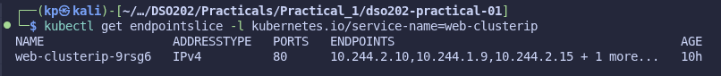

**Load balancing.** Nine requests through `web-clusterip` were answered by
all four Pods, confirming traffic is spread across every ready, selected
Pod rather than pinned to one.

**Readiness vs. liveness.** The companion manifest (Listing 5) as supplied
defines no `readinessProbe` or `livenessProbe`, even though the guide's
prose describes an HTTP readiness check against `/index.html` and a TCP
liveness check. Verified directly:

```text
$ kubectl get deployment web-deployment -o jsonpath='{.spec.template.spec.containers[0].readinessProbe}'
(empty)
```

Both probes were added to `manifests/03-deployment-web.yaml` to match the
guide's described behaviour. After re-applying, deleting `index.html`
inside one Pod caused it to drop to `0/1 Ready` within one probe period
(`periodSeconds: 5`), while `RESTARTS` stayed at `0`; readiness governs
traffic, not container lifecycle. Notably, the Pod's address was **not**
removed from the EndpointSlice; it remained listed with
`conditions.ready: false`:

```text
$ kubectl get endpointslice ... -o json | jq '.items[0].endpoints[] | "\(.addresses[0]) ready=\(.conditions.ready)"'
10.244.2.4  ready=true
10.244.2.8  ready=true
10.244.1.5  ready=false
10.244.2.9  ready=true
```

This is the modern EndpointSlice behaviour (each endpoint carries a ready
condition) rather than the older Endpoints API model the guide's prose
seems to describe (a separate `notReadyAddresses` list). kube-proxy still
correctly excluded the unready address from traffic, confirmed by a
follow-up nine-request load-balancing test that never reached it.

**Broken selector and LoadBalancer type.**

```text
$ kubectl create service clusterip broken-service --tcp=80:80
$ kubectl get endpointslice -l kubernetes.io/service-name=broken-service
ENDPOINTS
<unset>
$ kubectl create service loadbalancer lb-demo --tcp=80:80
$ kubectl get service lb-demo
EXTERNAL-IP
<pending>
```

Both matched the guide's predicted behaviour exactly: an imperatively
created Service's auto-generated selector matches no Pod, producing an
empty EndpointSlice; and a `LoadBalancer` Service stays `<pending>`
indefinitely because kind provides no cloud load-balancer controller.

### 3.8 Stage 7: Cleanup and reproducibility

```text
$ kubectl delete -f manifests/06-pod-client.yaml -f manifests/05-service-nodeport.yaml \
    -f manifests/04-service-clusterip.yaml -f manifests/03-deployment-web.yaml -f manifests/02-pod-web.yaml
$ kubectl get all
No resources found in dso202-practical-01 namespace.

$ kubectl apply -f manifests/
namespace/dso202-practical-01 unchanged
resourcequota/dso202-quota unchanged
limitrange/dso202-limits unchanged
pod/web-pod created
deployment.apps/web-deployment created
service/web-clusterip created
service/web-nodeport created
pod/client-pod created

$ kubectl diff -f manifests/ && echo "cluster matches repository"
cluster matches repository
```

Deleting every workload object declaratively and reapplying the whole
`manifests/` directory in one command fully rebuilt the practical, and
`kubectl diff` confirmed the resulting cluster state is byte-for-byte what
the committed manifests declare, proving the repository, not any manual
step, is the source of truth.

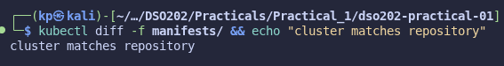

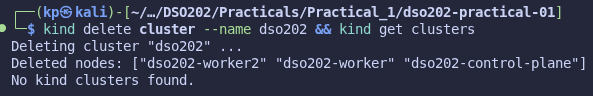

The cluster and all three node containers were removed in one command, and
a follow-up `kind get clusters` confirmed none remained, completing the
Stage 7 checkpoint exactly as stated ("`kind get clusters` reports no
clusters"). Rebuilding it later only requires `kind create cluster --config
cluster/kind-cluster.yaml` followed by `kubectl apply -f manifests/`,
confirming the repository is sufficient to reproduce the entire practical
from nothing.

**Observation: a real network fault during a later rebuild.** The cluster
was in fact rebuilt a second time after this first teardown, purely to
capture the additional evidence shown throughout this report (the Stage 0
version screenshot, the Stage 4 port-forward screenshot, and the three
distinct Deployment revisions above), then deleted again. During that
second `kubectl apply -f manifests/`, two of the three Deployment Pods sat
in `ImagePullBackOff` instead of starting. `kubectl describe pod` on one of
them showed the actual cause under `Events`: `dial tcp
[2600:1f18:...]:443: connect: network is unreachable`, meaning the node's
container runtime was trying to reach Docker Hub over IPv6 and that route
was not usable on this host. Pulling the same image with `docker pull
nginx:1.30-alpine` directly on the host succeeded immediately (using IPv4),
confirming the fault was specific to the node containers' network path, not
the image or registry. `kind load docker-image nginx:1.30-alpine --name
dso202` then loaded the already-pulled image straight into every node,
bypassing the broken path, and the stuck Pods recovered. This is a
genuinely different class of error from the earlier ones (an environment
network fault, not a mistake in the manifests) and was diagnosed the same
way: `kubectl describe pod` and its `Events` section first, before assuming
anything about the image or manifest was wrong.

## 4. Analysis

<!-- BLOCKED: the guide's own report-structure table (section 12.1) points
to "review questions in section 21", but the guide document supplied for
this practical only goes up to section 12 (Deliverables); section 21 does
not exist in it. This was checked directly (grep across the full guide
file) rather than assumed missing. Get the actual review questions from
the module tutor or the original source (the guide cites
https://hackmd.io/@sarojsanyasi/dso202-practical1-guide) before answering
them here: answers can't be drafted without knowing what's actually
being asked. -->

## 5. Reflection

<!-- DRAFT: this is graded specifically on being YOUR account (2 of 5
report marks). Read this over and rewrite it in your own words and voice
before submitting; do not hand it in verbatim. -->

The environment setup was the first real obstacle. The kind binary already
installed on the machine was v0.24.0, but the practical's manifest pins a
node image (`kindest/node:v1.36.1`) that only exists for kind v0.32.0 and
later. This wasn't obvious until I checked `kind version` against the
practical's stated minimum in Stage 0; it would have surfaced later and
less clearly as a failed or hanging `kind create cluster` if I hadn't
checked versions first. Installing the newer binary into `~/.local/bin`
(which precedes `/usr/local/bin` in `PATH`) avoided needing root access.

The most instructive error was that the practical's own companion manifest
file was internally inconsistent: the Namespace object and every other
listing use `dso202-practical-01`, but the Pod listing (Listing 4)
specifies `namespace: dso202-practical`. Applied as given, the Pod would
have landed in a namespace with no ResourceQuota or LimitRange; nothing
in that namespace would have been rejected by the quota, and the mismatch
would have been easy to miss since `kubectl apply` doesn't warn about
referencing a different namespace than a sibling file. I caught it only by
comparing every manifest's `metadata.namespace` field directly rather than
assuming they matched.

A second, similar gap: the guide's own prose (Stage 6, Step 7) describes a
readiness probe checking `/index.html` and a TCP liveness probe on the
Deployment, but the actual Deployment manifest (Listing 5) defines neither.
Running the demonstration as written did nothing; the target Pod stayed
`1/1 Ready` after its `index.html` was deleted. I diagnosed this by reading
the field directly with `kubectl get deployment ... -o
jsonpath='{.spec.template.spec.containers[0].readinessProbe}'`, which
returned nothing, rather than continuing to assume the probe existed but
simply hadn't tripped yet. Adding the two probes made the demonstration
behave as described.

If I were repeating this practical, I would capture the `kubectl rollout
history` evidence for Stage 5 before running Stage 7's reproducibility
test, since deleting and reapplying the Deployment resets its revision
counter to 1 and destroys the very history that Stage 5's checkpoint asks
for. I only noticed this after the fact and had to run a second
update/rollback cycle to regenerate it.

One thing that remains unclear to me: when the readiness probe failed, the
Pod's address stayed listed in the EndpointSlice with a `ready: false`
condition rather than being removed from the list entirely, which is not
how the guide's prose describes it (it implies the address disappears).
Traffic was still correctly routed away from it, so the outcome was right,
but I don't yet fully understand why the EndpointSlice API represents this
as a per-endpoint flag rather than by omission, and would want to read the
EndpointSlice API reference before the next practical that relies on it.

## 6. References

<!-- No pages were actually browsed during this session (no web search or
fetch tool was used), so an access date can't be honestly claimed for any of
these. Open the ones you genuinely used, add today's date, and drop any you
didn't actually consult. These are candidates only, taken from links the
guide itself names in Stage 0 and the Services section: -->

- Docker Engine installation: https://docs.docker.com/engine/install/
- kind Quick Start: https://kind.sigs.k8s.io/docs/user/quick-start/#installation
- kubectl install and setup: https://kubernetes.io/docs/tasks/tools/
- kind configuration reference: https://kind.sigs.k8s.io/docs/user/configuration/
- Kubernetes EndpointSlice API: https://kubernetes.io/docs/concepts/services-networking/endpoint-slices/
